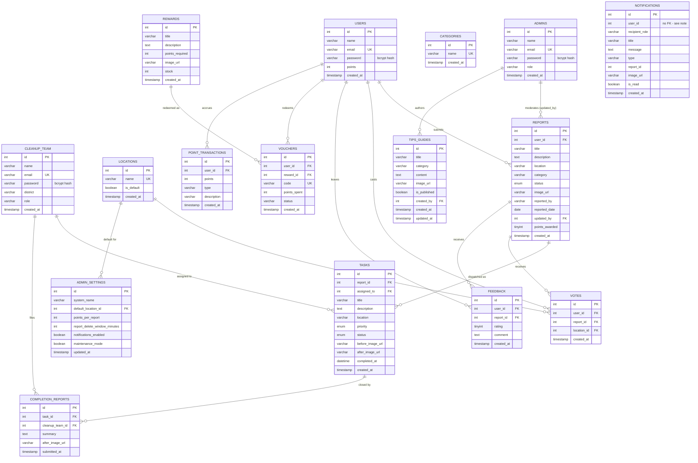

# SmartEco — Entity Relationship Diagram

This diagram is generated from `defaultdb.sql` (the source of truth for the
schema). Render it with any Mermaid-compatible viewer (GitHub renders it
natively, or paste it into https://mermaid.live).

## Design notes (why it isn't a "textbook" fully-normalized ERD)

- **`USERS` / `ADMINS` / `CLEANUP_TEAM` are separate tables, not one
  `accounts` table with a `role` column.** Each has a different shape
  (only `users` has `points`, only `cleanup_team` has `district`). The
  trade-off, called out explicitly here because a grader will ask: an id
  like `1` is **not globally unique across people** — it's only unique
  within its own table.

- **`NOTIFICATIONS.user_id` has no foreign key.** A notification's
  recipient can be a row in `users`, `admins`, or `cleanup_team` — three
  tables that reuse the same numeric ids. `recipient_role` disambiguates
  which table `user_id` points into. A single unified `accounts` table
  would allow a real FK here; that's a larger structural change than this
  schema currently makes. `idx_notifications_recipient (recipient_role,
  user_id)` keeps recipient lookups fast despite the missing FK.

- **`REPORTS.category` and `TASKS.location` / `REPORTS.location` are
  plain strings, not foreign keys** into `categories` / `locations`.
  `categories` and `locations` exist as lookup tables for future
  admin-managed dropdowns, but the current app still writes the raw
  string value directly (this mirrors what the frontend does today —
  see `defaultdb.sql` section 2 comments). If you want to defend this in
  a viva: it's intentional denormalization to avoid a breaking frontend
  change, not an oversight — but it *is* a known normalization gap worth
  mentioning as future work.
